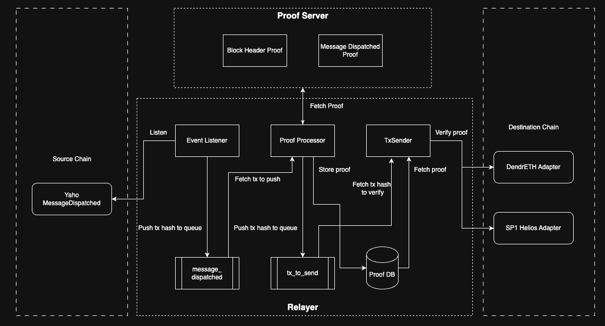

# Light Client based Prover for Hashi Adapter

This repository provides event proof and block header proof api for light client based Hashi Adapter.



1. `packages/server`: Prover API logic
2. `packages/relayer`: Listen to event and generate proof for verification on adapter contract. There are two kinds of light clients supported: [SP1 Helios](https://github.com/succinctlabs/sp1-helios) and [DendrETH](https://github.com/metacraft-labs/DendrETH), and two kinds of proof supported: Event proof for `MessageDispatched` event from Yaho and Block Header proof.
   1. Block header proof: Based on given slot and it's corresponding beacon block header ([Beacon block state root](https://eth2book.info/capella/part3/containers/blocks/#beaconblock)) from light client contract, prove the Execution block header (block hash) of the corresponding execution block number.
   1. `MessageDispatched` event proof: Generate event proof emitted from Yaaho contract based on the beacon block header from light client.

## Dev

### Prerequisites

Before running the application, ensure you have the following installed:

- [Node.js](https://nodejs.org/) (version 20.x or higher recommended)
- [Yarn](https://yarnpkg.com/) (version 1.x or higher)

### Installation

Clone the repository:

```bash
git clone https://github.com/crosschain-alliance/dendreth-proofs-api
```

Install

```bash
nvm use
yarn install
```

Navitage to each individual packages

```bash
cd packages/server # or cdd packages/relayer
cp .env.example .env # configure the .env file
yarn start
```

## Deployments

1. DendrETH Adapter & SP1 Helios Adapter: https://crosschain-alliance.gitbook.io/hashi/deployments/oracles#zk-light-clients
2. Contract code: https://github.com/gnosis/hashi
3. Modified version of SP1 Helios to support Gnosis Chain & LUKSO: https://github.com/crosschain-alliance/sp1-helios

## Run docker

```
docker-compose up --build
```

## Contributing

Feel free to submit issues and pull requests. For major changes, please open an issue first to discuss what you would like to change.

## License

This project is licensed under the MIT License. See the [LICENSE](LICENSE) file for details.
